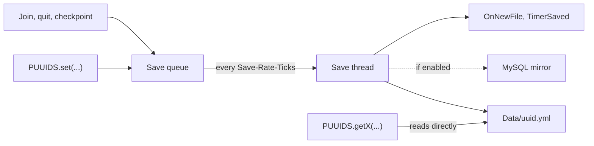

# How Saving Works

PUUIDs keeps file I/O off the main thread by queuing writes. Understanding the queue helps you avoid the one class of bug that catches people out: reading a value you have only just written.



## The write path

1. **You call `set`** (or `setNull`, `setLocation`, or a list helper). PUUIDs checks that your plugin is connected, gives the write a task id, and adds it to the end of the queue. Nothing touches the disk yet, so the call is quick and safe from any thread.
2. **A timer drains the queue.** Every `Advanced.Save-Rate-Ticks` (10 ticks, or half a second, by default) a task on a background thread takes up to `Advanced.Max-Processes-Per-Queue` plugin writes (25 by default) off the front of the queue, along with any pending player detail updates.
3. **Writes are grouped by player.** Each affected file is loaded once, every change for that player is applied in the order it was queued, and the file is written once.
4. **Files are replaced atomically.** PUUIDs writes to a temporary file and then moves it over the real one, so a reader always sees either the old file or the new one, never half of each.
5. **Afterwards**, the change is copied to [MySQL](MySQL.md) if the mirror is on, and PUUIDs fires [`OnNewFile`](Events.md#onnewfile) for newly created files and one [`TimerSaved`](Events.md#timersaved) per write.

## Timing and throughput

With default settings, a write usually reaches the disk within half a second. Two things can make it take longer.

**A backlog.** Only 25 plugin writes are saved per run, so the queue drains at about 50 writes per second. Player detail updates (join, quit and checkpoints) don't count towards that limit. A plugin that queues 5,000 writes at once, for example through `addToAllWithout` on a big server, waits more than a minute and a half for the last of them. Server owners can raise both settings, see [Server Owners](Server-Owners.md#advanced).

**Paused saving.** The queue keeps accepting writes but stops saving them:

- during startup, until PUUIDs has finished scanning the `Data` folder,
- while `/puuids reset` or a MySQL import is running,
- while an admin has saving frozen with `/puuids togglesave` (a debug command).

Everything queued in the meantime is saved once saving resumes.

## The read-after-write rule

Getters read the file directly. They don't look at the queue. So:

> **A value you've passed to `set` isn't visible to the getters until it has been saved.**

```java
PUUIDS.set(this, uuid, "Kills", 5);   // queued
PUUIDS.getInt(this, uuid, "Kills");   // can still return the old value

// ...a moment later, once the queue has drained:
PUUIDS.getInt(this, uuid, "Kills");   // 5
```

This matters most for read-modify-write code. If the same player triggers two updates before the first is saved, both read the same old value, and one update is lost:

```java
// Two kills within the same half second:
PUUIDS.set(this, uuid, "Kills", PUUIDS.getInt(this, uuid, "Kills") + 1); // reads 4, queues 5
PUUIDS.set(this, uuid, "Kills", PUUIDS.getInt(this, uuid, "Kills") + 1); // reads 4 again, queues 5
// The file ends up at 5, not 6.
```

The list helpers (`addToStringList` and friends) work this way internally, so they have the same problem.

### Designing around it

- **Keep the live value in memory for online players,** and use PUUIDs as the place it's saved to. You read the file once when the player joins, then every change updates your copy and queues a `set`. Nothing reads the file while writes might be pending. This is the recommended approach for anything that changes often, and [Patterns](Patterns.md#cache-values-for-online-players) has a ready-to-use version.
- **Don't read back what you just wrote.** If you already know the new value, use it.
- **Wait for the save** when you really need to know the data is on disk. The id `set` returns shows up in a [`TimerSaved`](Events.md#timersaved) event once it is.

Plain writes that don't depend on the old value (a setting toggled from a menu, a timestamp, a nickname) are always safe. Writes for the same player are saved in the order they were queued, so the last `set` wins.

## Shutdown and crashes

When PUUIDs is disabled, it saves every online player's details, then saves **everything** left in the queue in one go, ignoring the per-run limit. No events are fired for these final writes, because the server is shutting down.

Plugins that depend on PUUIDs are disabled before it, so anything you `set` in your own `onDisable` is included.

If the server crashes, whatever was still in the queue is lost, along with the part of each online player's session since their last checkpoint.

## When a save fails

If a file can't be written (a full disk, missing permissions), PUUIDs logs a warning and drops that player's batch of changes. No `TimerSaved` event is fired for them. If you wait for `TimerSaved`, use a timeout instead of waiting forever.

## Files that get removed

PUUIDs deletes player files in two situations, both during startup. Either way, every plugin's data in that file goes with it.

- **Inactivity clean-up.** Files belonging to players who haven't been seen for `Settings.File-Cleanup.Max-Days` days (365 by default) are deleted. Server owners can turn this off.
- **Invalid files.** A file missing any of `UUID`, `Username` or `Last-On` is treated as corrupt. The usual way to end up with one is a plugin writing data for a UUID that has never joined, so check `hasFile(uuid)` before writing for players who may not have played.

Next: [Events](Events.md)
